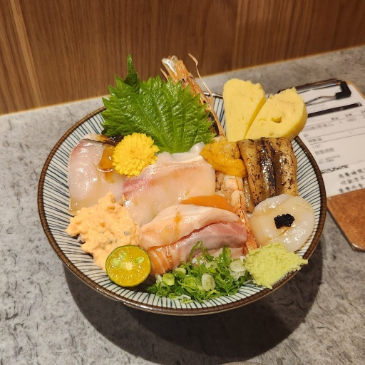

# JPEG 기반 영상 압축

**기간:** 2024.11.04 – 2024.11.24

## 개요

512×512 음식 사진 한 장으로 합/차 서브밴드 분해와 8×8 블록 DCT 두 변환 방식의 손실 압축을 비교한다. 변환, 양자화,
지그재그 스캔, 단항 부호화와 그 역과정을 직접 구현하고, QP를 바꿔 rate(bpp)와 distortion(MSE)을 잰다. 구현, 측정 방식,
전체 결과는 [`docs/experiment-log.md`](docs/experiment-log.md)(이하 로그)에 있다.

| 실험 | 내용 |
| --- | --- |
| 서브밴드 변환 | 합/차 변환을 가로·세로 3단계씩 적용해 서브밴드 64개로 분해하고 역변환 |
| 서브밴드 압축 | YUV 서브밴드 64개(64×64)를 DCT 없이 양자화 → 지그재그 → 단항 부호화. QP 스윕, 서브밴드·채널별 최적 QP 탐색과 그 스케일 |
| 블록 DCT JPEG | YUV 영상을 8×8 블록으로 나눠 −128 이동 → DCT → JPEG 표준 표로 양자화 → 지그재그 → 단항 부호화. QP 스윕 |

rate는 전체 부호 길이를 512 × 512로 나눈 값, distortion은 복원 영상과 입력 영상의 MSE다(실험 1은 RGB, 실험 2·3은 YUV).

## 결과

### 서브밴드 변환

| 순서 | 복원 MSE |
| --- | --- |
| 가로 먼저 | 0.0 |
| 세로 먼저 | 0.0 |

### 서브밴드 압축

모든 서브밴드·채널에 같은 QP:

| QP | MSE | rate (bpp) |
| --- | --- | --- |
| 139 | 7.99 | 6.42 |
| 160 | 9.63 | 5.96 |
| 192 | 12.47 | 5.44 |
| 240 | 17.49 | 4.93 |
| 310 | 24.71 | 4.47 |
| 450 | 38.69 | 3.98 |

서브밴드·채널별 최적 QP(`cost = 0.05 × MSE + 0.95 × rate` 최소)에 SV를 곱한 결과. 최적 QP 표는 로그에 있다.

| SV | MSE | rate (bpp) |
| --- | --- | --- |
| 3.1 | 4.55 | 5.86 |
| 3.5 | 5.65 | 5.52 |
| 4 | 6.93 | 5.19 |
| 5 | 9.85 | 4.73 |
| 6 | 13.80 | 4.43 |
| 7.7 | 20.52 | 4.09 |

### 블록 DCT JPEG

| QP | MSE | rate (bpp) |
| --- | --- | --- |
| 1 | 15.56 | 4.18 |
| 2 | 26.25 | 3.58 |
| 3 | 35.36 | 3.39 |
| 5 | 53.75 | 3.23 |
| 10 | 108.30 | 3.11 |
| 20 | 234.44 | 3.05 |

## 기타

- 보고서는 [`docs/`](docs/)에 있다.
- 구현은 `src/`(변환, 양자화, 지그재그, 단항 부호, rate-distortion), 실험은 `experiments/`에 있다.
