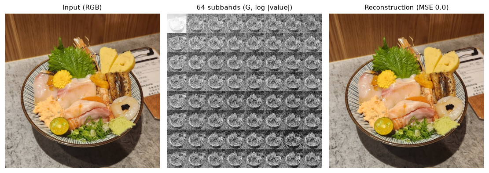
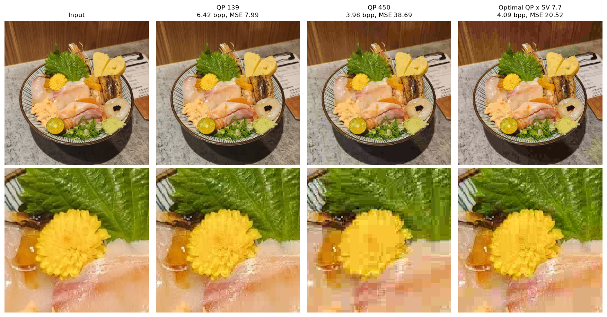
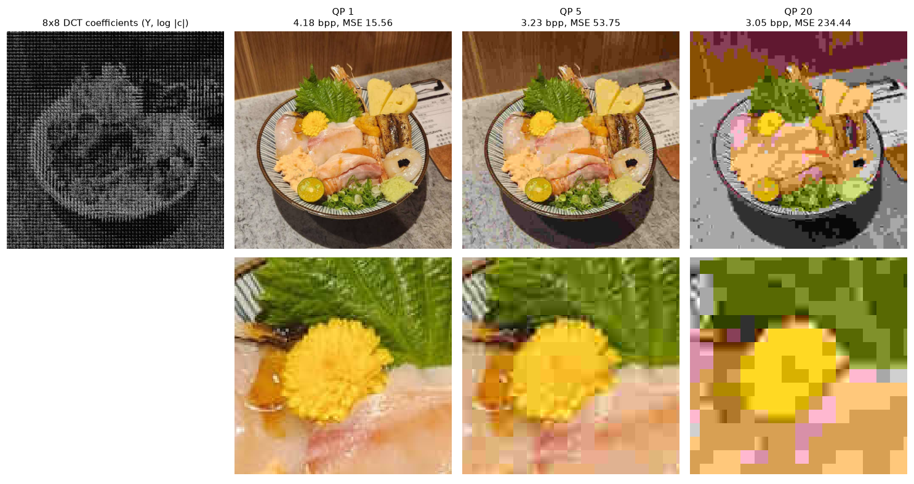

# JPEG 기반 영상 압축

**기간:** 2024.11.04 – 2024.11.24

## 개요

512×512 음식 사진 한 장으로 합/차 서브밴드 분해와 8×8 블록 DCT 두 변환 방식의 손실 압축을 비교한다. 변환, 양자화,
지그재그 스캔, 단항 부호화와 그 역과정을 직접 구현하고, QP를 바꿔 rate(bpp)와 distortion(MSE)을 잰다. 구현, 측정 방식,
전체 결과는 [`docs/experiment-log.md`](docs/experiment-log.md)(이하 로그)에 있다.

| 실험 | 내용 |
| --- | --- |
| 서브밴드 변환 | 합/차 변환을 가로·세로 3단계씩 적용해 서브밴드 64개로 분해하고 역변환 |
| 서브밴드 압축 | YUV 서브밴드 64개(64×64)를 DCT 없이 양자화 → 지그재그 → 단항 부호화. QP 스윕, 서브밴드·채널별 최적 QP 탐색과 그 스케일 |
| 블록 DCT JPEG | YUV 영상을 8×8 블록으로 나눠 −128 이동 → DCT → JPEG 표준 표로 양자화 → 지그재그 → 단항 부호화. QP 스윕 |

rate는 전체 부호 길이를 512 × 512로 나눈 값, distortion은 복원 영상과 입력 영상의 MSE다(실험 1은 RGB, 실험 2·3은 YUV).

## 결과

실험별 단계 영상이다. 서브밴드 압축과 블록 DCT 그림의 아래 줄은 같은 영역(128×128)을 확대한 것이다. 전체 수치와
rate-distortion 곡선은 로그에 있다.

### 서브밴드 변환

*입력, 세로 먼저 3단계 분해한 서브밴드 64개(G 채널, 대역마다 log |값|을 정규화), 역변환 결과.*

### 서브밴드 압축

*입력, 모든 서브밴드에 QP 139와 450, 서브밴드·채널별 최적 QP × SV 7.7로 압축한 뒤 복원한 영상.*

### 블록 DCT JPEG

*Y 채널 8×8 블록 DCT 계수(−128 이동 후, log |계수|), QP 1, 5, 20으로 압축한 뒤 복원한 영상.*

## 기타

- 보고서는 [`docs/`](docs/)에 있다.
- 구현은 `src/`(변환, 양자화, 지그재그, 단항 부호, rate-distortion), 실험은 `experiments/`에 있다.
