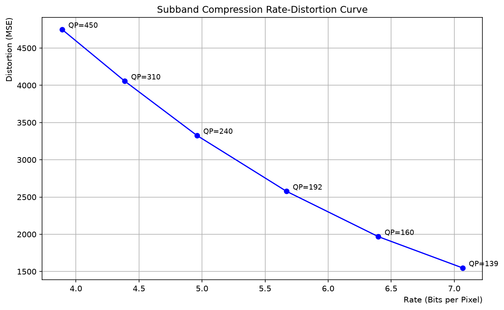
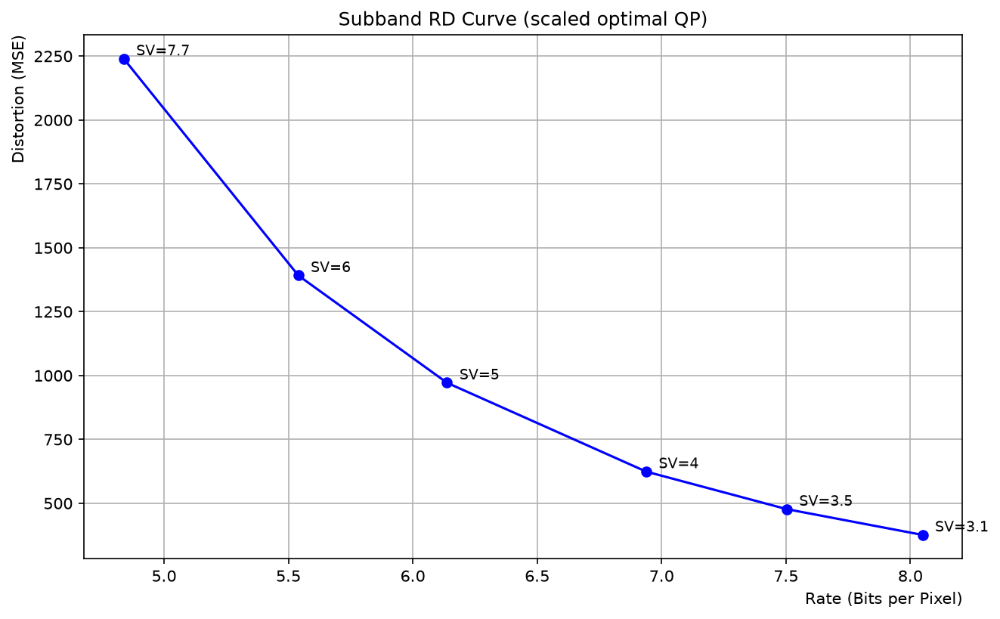
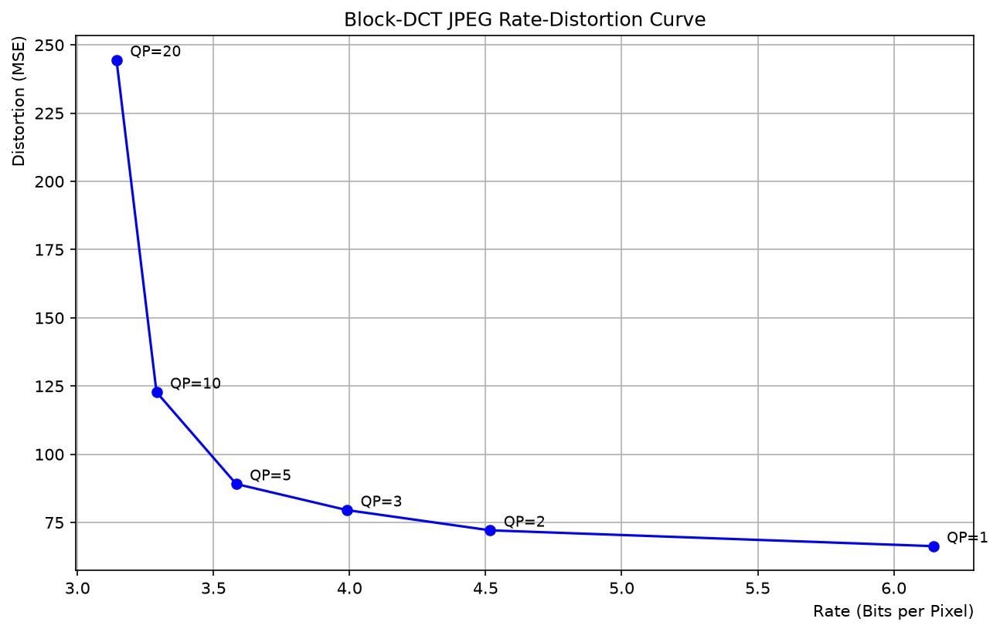

# Results

Produced by a single reproducible command (no external data — a deterministic
512x512 synthetic image is generated with a fixed seed):

```bash
python run_all.py
```

Artifacts are written to [`results/`](results/) and tracked in git. The
synthetic input is [`results/input_synthetic.png`](results/input_synthetic.png).

## 1. Subband transform — invertibility

3-level sum/difference decomposition (64 subbands), both scan orders,
reconstructed. See [`results/01_subband_transform.log`](results/01_subband_transform.log).

| Order | Reconstruction MSE |
| --- | --- |
| horizontal-first | 0.0 |
| vertical-first | 0.0 |

The transform is perfectly invertible on the synthetic image.

## 2. Subband compression — rate-distortion

Flat unit quantization tables, QP sweep, then a per-subband optimal-QP search
scaled by a factor `SV`. Full log:
[`results/02_subband_compression.log`](results/02_subband_compression.log).

QP sweep (bpp vs MSE):

| QP | MSE | rate (bpp) |
| --- | --- | --- |
| 139 | 1548.6 | 7.07 |
| 192 | 2576.8 | 5.67 |
| 240 | 3326.4 | 4.96 |
| 450 | 4750.3 | 3.89 |

Scaled optimal-QP RD (better — lower MSE at comparable rate):

| SV | MSE | rate (bpp) |
| --- | --- | --- |
| 3.1 | 376.2 | 8.05 |
| 4.0 | 623.9 | 6.94 |
| 6.0 | 1391.7 | 5.54 |
| 7.7 | 2239.7 | 4.84 |




## 3. Block-DCT JPEG — rate-distortion

Textbook 8x8 block DCT with the standard JPEG luminance/chrominance tables.
Log: [`results/03_block_dct_jpeg.log`](results/03_block_dct_jpeg.log).

| QP | MSE | rate (bpp) |
| --- | --- | --- |
| 1 | 66.3 | 6.14 |
| 3 | 79.5 | 3.99 |
| 5 | 89.1 | 3.58 |
| 10 | 122.8 | 3.29 |
| 20 | 244.5 | 3.14 |



The block-DCT JPEG pipeline reaches far lower MSE at low bit-rates than the flat
subband scheme, as expected — the DCT concentrates energy into few coefficients.

## Original notebook figures

The figures and logs embedded in the original Lena notebooks are preserved
under [`results/notebook_reference/`](results/notebook_reference/) for
provenance (they were produced on the Lena image, which is not redistributed).
