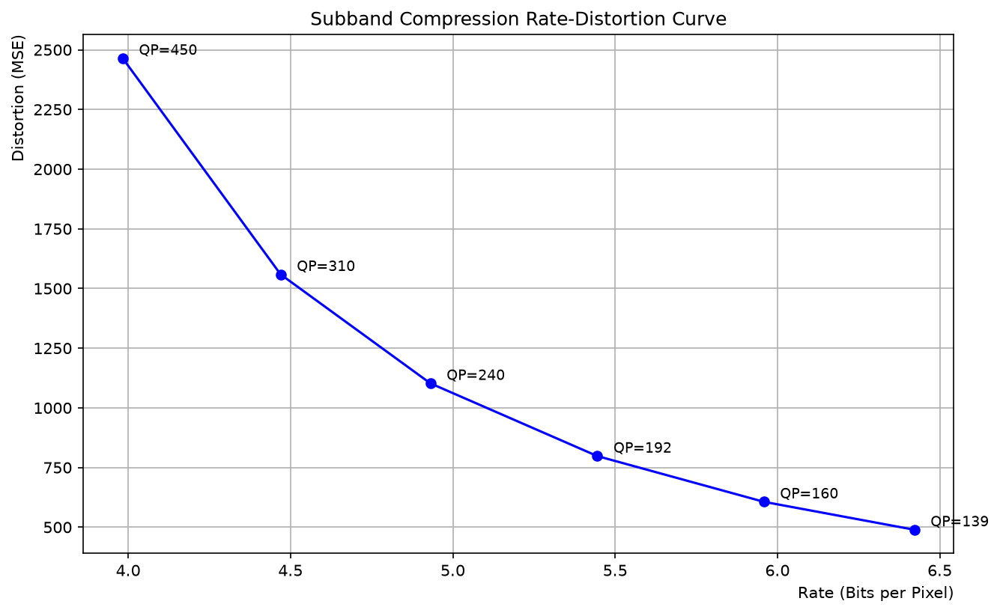
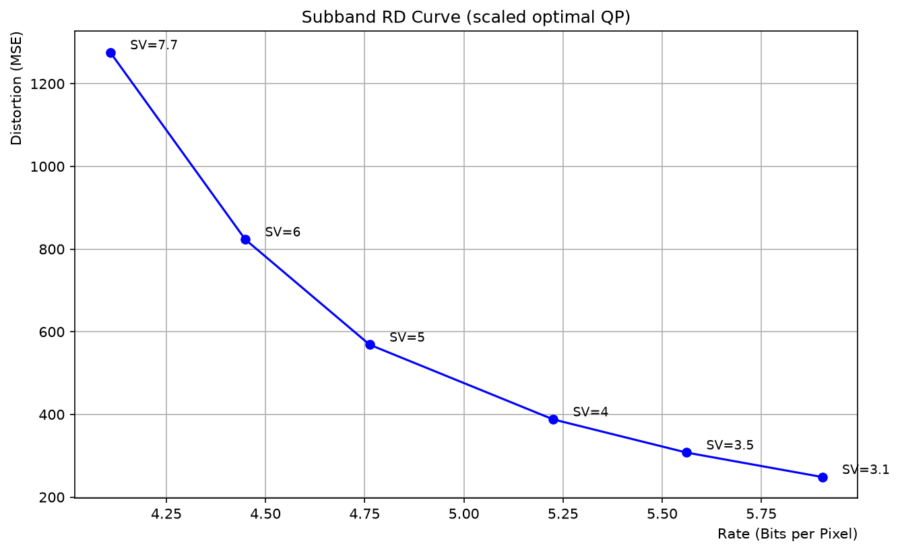
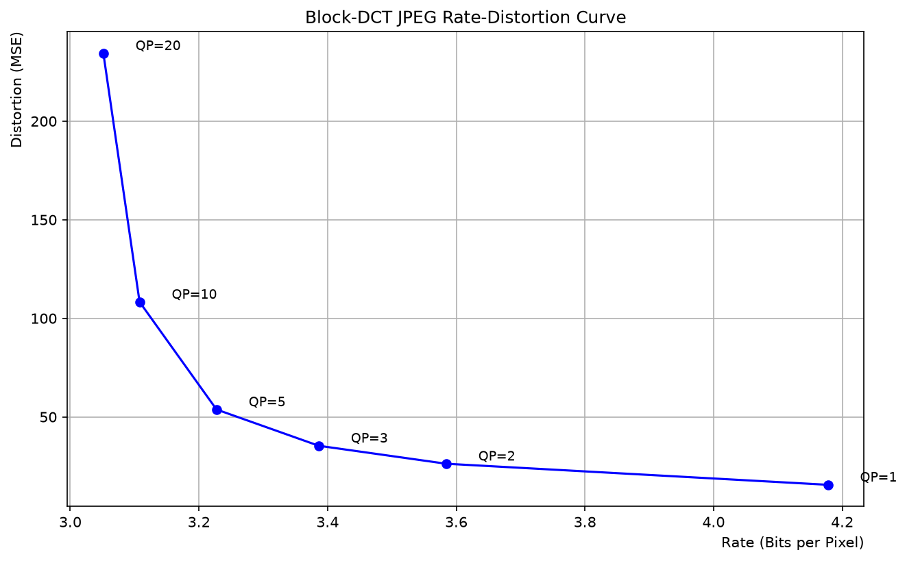

# 실험 기록

512×512 음식 사진 한 장(`assets/food.jpg`)으로 합/차 서브밴드 분해와 8×8 블록 DCT 두 변환 방식의 손실 압축을 구현하고
rate-distortion을 측정한 과정과 결과를 정리한다.

## 1. 구현

변환부터 역변환까지 전 과정을 NumPy(DCT만 `scipy.fftpack`)로 구현했다.

| 단계 | 구현 |
| --- | --- |
| 색공간 | 실험 1은 RGB, 실험 2·3은 OpenCV `BGR2YUV`, float32 |
| 서브밴드 변환 | 이웃한 두 샘플 `a, b`를 합 `a + b`와 차 `a − b`로 나눔, int32. 역변환은 `(합 + 차) // 2`, `(합 − 차) // 2` |
| 서브밴드 분해 | 한 방향으로 3단계 재귀 후 나온 8개 대역을 다른 방향으로 3단계 재귀 → 64×64 서브밴드 64개 |
| DCT | 정규직교 2-D DCT (`norm="ortho"`, 행·열 분리) |
| 양자화 | `round(계수 / (표 × QP))`, 역양자화는 `값 × 표 × QP` |
| 양자화 표 | 블록 DCT: JPEG 표준 휘도·색차 표(Annex K). 서브밴드: 모든 칸이 1인 표 |
| 지그재그 스캔 | 대각선 순서, 블록 DCT는 8×8, 서브밴드는 64×64 |
| 엔트로피 부호 | 단항 부호. `v ≥ 0`은 `'1' × v + '0'`, 음수는 `'1' × abs(v) + '0' + '-'` |
| rate | 전체 부호 문자 수 / (512 × 512) [bpp] |
| distortion | 복원 영상과 입력 영상의 MSE (세 채널 전체) |

## 2. 최적화

지그재그 스캔은 크기별로 스캔 순서 인덱스를 한 번 만들어 두고 배열 인덱싱으로 바꿨고, 단항 부호화·복호화는 리스트
컴프리헨션으로 바꿨다. 최적 QP 탐색은 서브밴드마다 QP 299개를 한 번에 배열 연산으로 계산한다. 이때 부호 문자열을
만들지 않고 길이를 `|q| + 1 + (q < 0)`의 합으로 구하며, 복원값은 역양자화 결과를 쓴다. 바꾸기 전과 후의 모든 출력
(서브밴드와 복원 영상, 부호 문자열, 스윕 결과, 최적 QP, SV 결과)이 자료형까지 같은 것을 확인한 뒤 3장의 수정을 했다.

아래 시간은 3장의 수정 전 과정에서 쟀다. 마지막 열은 3장의 수정으로 과정이 바뀐 단계다.

| 단계 | 기존 | 최적화 | 3장 수정 후 과정 변화 |
| --- | --- | --- | --- |
| 실험 1 | 0.07 s | 0.07 s | 없음 |
| 실험 2 단일 QP + QP 스윕 | 2.86 s | 0.92 s | 복원 영상으로 MSE 계산 |
| 실험 2 최적 QP 탐색 | 81.1 s | 2.9 s | V 채널 탐색 추가 |
| 실험 2 SV 스케일 | 2.48 s | 0.80 s | 복원 영상으로 MSE 계산, V 채널 QP 따로 사용 |
| 실험 3 | 5.09 s | 2.87 s | −128 이동, 반올림·클리핑 |
| 합계 | 91.6 s | 7.6 s | |

## 3. 측정 방식 수정

| 항목 | 수정 전 | 수정 후 |
| --- | --- | --- |
| 블록 DCT 복원 영상 | float를 그대로 uint8로 변환(소수점 버림, 0–255 밖의 값은 넘침) | 반올림 후 `[0, 255]`로 자름 |
| 블록 DCT 입력 | 0–255 값에 바로 DCT | JPEG와 같이 −128 이동 후 DCT, 복원 때 +128 |
| 서브밴드 distortion | 원본 서브밴드 64개와 복원 서브밴드 64개의 MSE | 복원 서브밴드를 역변환해 `[0, 255]`로 자른 영상과 입력 영상의 MSE |
| 서브밴드 최적 QP | Y와 U에서만 탐색, V에는 U의 QP 사용 | Y, U, V 각각 탐색 |

수정 전 값:

| 실험 | 설정 | MSE | rate (bpp) |
| --- | --- | --- | --- |
| 블록 DCT | QP 1 | 17.1306 | 6.3448 |
| 블록 DCT | QP 20 | 255.4678 | 3.1508 |
| 서브밴드 | QP 139 | 489.3656 | 6.4215 |
| 서브밴드 | QP 450 | 2464.8440 | 3.9830 |
| 서브밴드 | SV 3.1 | 248.5568 | 5.9035 |
| 서브밴드 | SV 7.7 | 1275.6813 | 4.1088 |

블록 DCT에서 uint8 변환만 고치면(−128 이동 없음) QP 1의 MSE는 15.535, QP 20은 234.467이다. rate는 −128 이동으로
바뀌었다.

## 4. 실험 1: 서브밴드 변환의 역변환

3단계 분해(서브밴드 64개)를 두 순서로 하고 바로 역변환했다. 정수 입력에서 `a + b`와 `a − b`는 홀짝이 같아 `// 2`가
정확히 나누어떨어진다.

| 순서 | 복원 MSE |
| --- | --- |
| 가로 먼저 | 0.0 |
| 세로 먼저 | 0.0 |

## 5. 실험 2: 서브밴드 압축

세로 먼저 3단계 분해한 YUV 서브밴드 64개(64×64)의 채널마다 양자화 → 지그재그 → 단항 부호화를 하고 복원했다. DCT는 쓰지
않는다.

**단일 QP.** QP 100: 전체 2,042,576비트, rate 7.7918 bpp, MSE 4.9234.

**QP 스윕.** 모든 서브밴드·채널에 같은 QP.

| QP | MSE | rate (bpp) |
| --- | --- | --- |
| 139 | 7.9932 | 6.4215 |
| 160 | 9.6306 | 5.9579 |
| 192 | 12.4681 | 5.4449 |
| 240 | 17.4859 | 4.9308 |
| 310 | 24.7078 | 4.4695 |
| 450 | 38.6868 | 3.9830 |

**최적 QP.** 서브밴드·채널마다 QP 1–299 중 `cost = 0.05 × MSE + 0.95 × rate`가 가장 작은 값을 골랐다. 여기서 MSE와
rate는 그 서브밴드 한 채널(64×64)에서 잰 값이다(rate = 비트 수 / 4096). 표의 행은 세로 방향 대역 번호, 열은 가로
방향 대역 번호다. 대역 번호를 3비트로 쓰면 앞 비트부터 1단계, 2단계, 3단계에서 합(0)과 차(1) 중 어느 쪽인지를 나타낸다.

Y:

| 세로 \ 가로 | 0 | 1 | 2 | 3 | 4 | 5 | 6 | 7 |
| --- | --- | --- | --- | --- | --- | --- | --- | --- |
| 0 | 95 | 34 | 25 | 26 | 21 | 21 | 16 | 22 |
| 1 | 35 | 28 | 23 | 25 | 19 | 19 | 21 | 20 |
| 2 | 27 | 23 | 20 | 22 | 16 | 19 | 18 | 18 |
| 3 | 28 | 26 | 21 | 22 | 17 | 19 | 30 | 19 |
| 4 | 21 | 18 | 18 | 18 | 14 | 15 | 17 | 16 |
| 5 | 21 | 20 | 20 | 19 | 16 | 16 | 16 | 17 |
| 6 | 16 | 19 | 19 | 30 | 18 | 17 | 56 | 23 |
| 7 | 21 | 21 | 18 | 19 | 18 | 18 | 22 | 17 |

U:

| 세로 \ 가로 | 0 | 1 | 2 | 3 | 4 | 5 | 6 | 7 |
| --- | --- | --- | --- | --- | --- | --- | --- | --- |
| 0 | 93 | 20 | 16 | 17 | 14 | 14 | 12 | 12 |
| 1 | 22 | 17 | 14 | 16 | 12 | 12 | 10 | 12 |
| 2 | 17 | 14 | 10 | 12 | 10 | 10 | 10 | 10 |
| 3 | 17 | 14 | 12 | 14 | 10 | 12 | 10 | 10 |
| 4 | 14 | 12 | 10 | 10 | 10 | 10 | 10 | 10 |
| 5 | 14 | 12 | 10 | 12 | 10 | 10 | 10 | 10 |
| 6 | 12 | 10 | 10 | 10 | 10 | 10 | 10 | 10 |
| 7 | 12 | 12 | 10 | 10 | 10 | 10 | 10 | 10 |

V:

| 세로 \ 가로 | 0 | 1 | 2 | 3 | 4 | 5 | 6 | 7 |
| --- | --- | --- | --- | --- | --- | --- | --- | --- |
| 0 | 104 | 20 | 16 | 16 | 14 | 13 | 10 | 12 |
| 1 | 21 | 18 | 12 | 12 | 12 | 12 | 10 | 10 |
| 2 | 16 | 12 | 10 | 10 | 10 | 10 | 10 | 10 |
| 3 | 17 | 14 | 12 | 12 | 10 | 10 | 10 | 10 |
| 4 | 15 | 12 | 10 | 10 | 10 | 10 | 10 | 10 |
| 5 | 13 | 12 | 10 | 10 | 10 | 10 | 10 | 10 |
| 6 | 12 | 10 | 10 | 10 | 10 | 10 | 10 | 10 |
| 7 | 12 | 12 | 10 | 10 | 10 | 10 | 10 | 10 |

**최적 QP 스케일.** 위 QP에 SV를 곱해 압축했다.

| SV | MSE | rate (bpp) |
| --- | --- | --- |
| 3.1 | 4.5489 | 5.8568 |
| 3.5 | 5.6503 | 5.5196 |
| 4 | 6.9318 | 5.1883 |
| 5 | 9.8533 | 4.7339 |
| 6 | 13.8002 | 4.4253 |
| 7.7 | 20.5241 | 4.0913 |

## 6. 실험 3: 블록 DCT JPEG

YUV 영상을 8×8 블록 4,096개로 나눠 블록마다 −128 이동 → DCT → 양자화(JPEG 표준 표 × QP) → 지그재그 → 단항 부호화를
하고 복원했다.

| QP | MSE | rate (bpp) |
| --- | --- | --- |
| 1 | 15.5647 | 4.1776 |
| 2 | 26.2482 | 3.5843 |
| 3 | 35.3603 | 3.3863 |
| 5 | 53.7530 | 3.2274 |
| 10 | 108.2953 | 3.1078 |
| 20 | 234.4399 | 3.0515 |

## 7. 한계

- 영상 한 장으로 측정했다.
- 단항 부호는 최적 엔트로피 부호가 아니며, 부호 길이를 rate 추정치로만 쓴다. 음수 표시 `'-'`도 한 비트로 센다.
- 서브밴드 최적 QP의 cost는 서브밴드 영역의 MSE로 계산하고, 표에 적은 distortion은 복원 영상의 MSE다.
